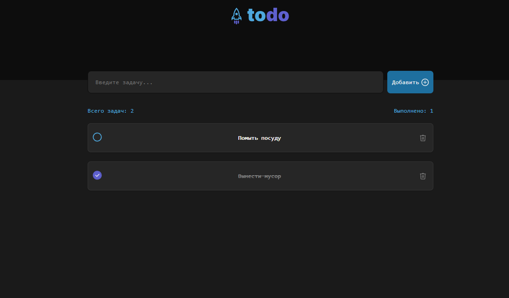

# To-Do 

[Ссылка на деплой](https://daniltro.github.io/myVueTodo/)

### Приложение позволяет вести список дел, обладает следующим функционалом

- Добавить дело
- Удалить дело
- Пометить выполненным
- Сохраняет дела в локальном хранилище браузера
- Адаптировано под мобильные устройства

### Инструкция по запуску

- Создайте папку для проекта и перейдите в неё.
- Склонируйте репозиторий `git@github.com:daniltro/myVueTodo.git`
- Установите зависимости `npm install`
- Запускайте проект `npm run dev`

